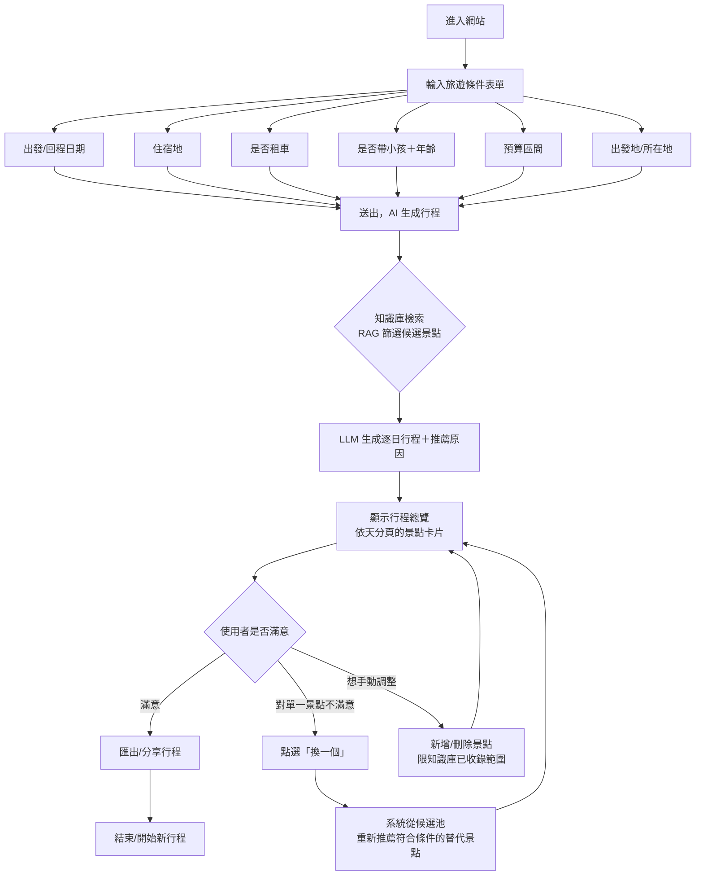

# USER FLOW｜旅遊決策助手（沖繩試點）v0.1

## 主流程圖

## 分解說明

### 步驟 1：條件輸入（對應 PRD FR1）
- 使用者第一次進站，看到單頁表單，一次填完 6 項條件
- 「是否帶小孩」勾選「是」時，動態展開「年齡區間」欄位（例如：學齡前 / 國小 / 青少年，因為適合的景點類型差異大）
- 表單送出前做基本驗證（日期範圍合理、住宿地非空）

### 步驟 2：行程生成（對應 PRD FR2）
- 使用者看到 loading 狀態（目標 15 秒內完成）
- 後端：依「出發地/住宿地座標」對知識庫做地理分群 → 依親子/預算/租車條件過濾 → 交給 LLM 生成逐日安排
- 若知識庫在某天/某地區候選不足（例如篩選後少於 3 個景點），系統需有 fallback 邏輯（放寬條件並提示使用者「此區域符合條件的景點較少，已放寬預算限制」），而不是回傳空結果

### 步驟 3：行程檢視（對應 PRD FR3）
- 以「Day 1 / Day 2 / ...」分頁或卡片列表呈現
- 每個景點卡片顯示：名稱、圖片、建議停留時間、推薦原因（例如：「親子友善、雨天可室內活動、距住宿地 15 分鐘車程」）
- 「換一個」按鈕：觸發同條件下的替代推薦，不影響其他天的行程

### 步驟 4：輸出（對應 PRD FR4）
- 提供「複製行程文字」或簡易匯出（PDF/圖片），方便使用者帶出去用（不需要即時上網查）

## 邊界情境（Edge Cases，需在開發前想清楚）

| 情境 | 建議處理方式 |
|---|---|
| 使用者輸入的天數過長（例如 14 天）但知識庫景點只有 100 多個 | 提示「知識庫景點有限，行程可能出現重複，建議 3–7 天」 |
| 住宿地不在沖繩本島知識庫涵蓋範圍 | 提示「目前僅支援沖繩本島試點，該地區暫不支援」 |
| 使用者不租車但住宿地遠離景點群 | 行程建議需優先安排「大眾運輸可達」的景點，並在推薦原因標註交通方式 |
| LLM 生成結果地理位置跳來跳去（不合理動線） | 這是主要技術風險（見 PRD 風險章節），MVP 開發時需優先驗證此邏輯，必要時用規則式地理分群取代純 LLM 排序 |

## 未來流程擴充點（Phase 2/3，先標記不做）
- 在「行程檢視」頁面加入「今日狀態檢查」按鈕（串接天氣/營業時間 API），高亮衝突項目
- 主動推播通知（需使用者授權定位與通知權限）
